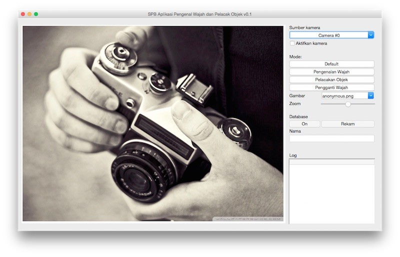
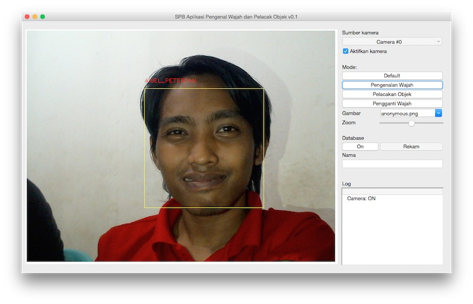
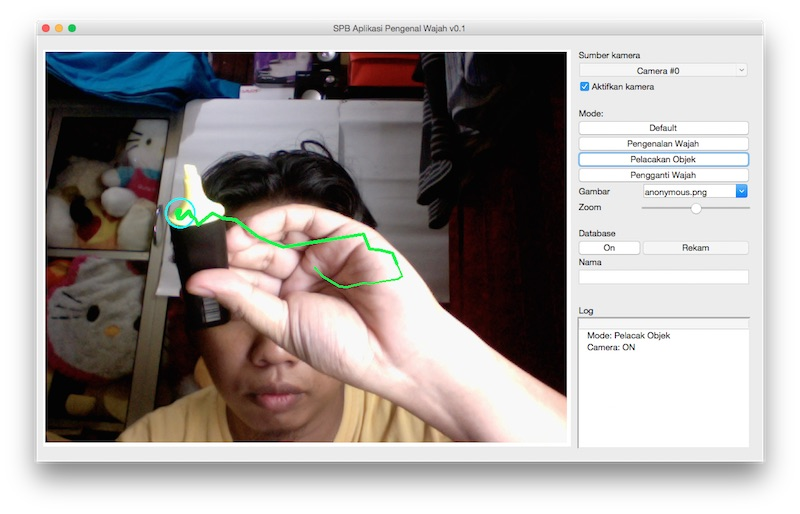
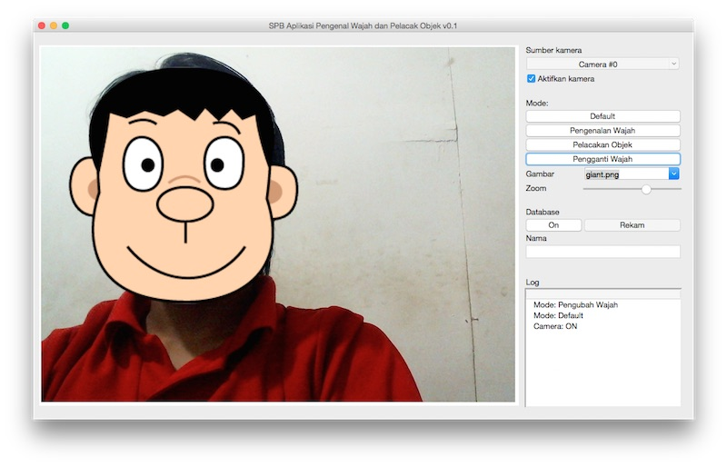

# Setup

* OpenCV
   Silakan download pada laman http://opencv.org/

* Clone repo
```
cd ~
mkdir github
cd github
git clone https://github.com/janglapuk/SPB-OpenCV-Recognizer.git
cd SPB-OpenCV-Recognizer
```
   
* Gunakan virtual environment
   Asumsikan anda memiliki virtual environment ([virtualenv](http://docs.python-guide.org/en/latest/dev/virtualenvs/)) dengan interpreter Python versi 3.x dengan nama `cv3`
```
workon cv3
```
   Pastikan anda beralih menggunakan Python versi >= 3.4 dengan memeriksa versi interpreter
```
python --version
```
   dengan output:
```
Python 3.5.1
```

* Install requirements
```
pip install -r requirements.txt
```

* Jalankan aplikasi
```
cd src
python main.py
```

# Screenshot
### Aplikasi utama






